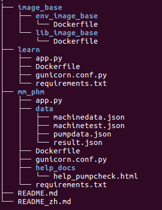

# PHM SERVER

[中文版](./README_zh.md)

## Overview

This server was written for phm server of maomeng. 

The basic functionality of this server is that maomeng using API supported by the phm server can get the result of analyzing their data.

## Requirement

For local deployment, the requirements are listed as follows.

- OS: Ubuntu 16.04+ (大部分主流linux系统,能够安装运行docker即可)
- python, version 3.6.1+
- dependencies: please view [requirements.txt](mm_phm/requirements.txt)

However, we recommend you to use docker to deploy the server, with requirements:

- docker, version 18.09.7+

Note:The above deployment environment has been tested, but we can not guarantee whether other environments can run normally. 

## Directory tree




The above files are used directly in the README for explanation, so the directory tree is given here for user comparison.

## Build env using docker
We recommend you to build docker image and then run the server.

#### Step1. CentOS8.1+python3.6
```
cd image_base/env_image_base
sudo docker build --tag env_image_base:1.0 .
```

#### Step2. Install dependencies
```
cd image_base/lib_image_base
sudo docker build --tag lib_image_base:1.0 .
```

#### Step3. App image
```
cd mm_phm
sudo docker build --tag mm_phm:1.0 .
```

The reason why the application image is established in three steps is because the pulling of the CentOS base image and the installation of python3 are more time-consuming, and the third-party dependency may increase later. The most important thing is to facilitate rapid development.

## Usage

#### Mode 1: Pseudo-terminal interactive mode
```
sudo docker run -it -p 8000:8000 --name test1 mm_phm:1.0
```

#### Mode 2: Background mode (recommended mode)
```
sudo docker run -d -p 8000:8000 --name test1 mm_phm:1.0
```

Enter the above command (Method 1 or Method 2)directly in the command line and press Enter to start the application service.

## API Specifications

The server will run a HTTP service on 8000 port by default, with RESTful API:

```
http://127.0.0.1:8000/apiv3/opendata/analyze/pumpcheck , method = ['GET', 'POST']
```


For request, you need to insert the face image file in request body, with json format:

``` 
{
  "top": 5,
  "image": "ZXhjaXRlZA=="
}
```

Here `top` is the number of most similar faces to response. `image` is the upload face image itself, encoded by Base64. Refer to unit test if you are ambiguous.

The response will be included in response body, with json format:

```
{
  "similar_faces": [
    {
      "faceID": "00001",
      "similarity": 0.67,
      "meta_data": {
        "name": "张三",
        "organization": "XX代表团",
        "title": "全国人大代表"
      }
    }
  ]
}
```

Here `similarity` is the similarity score between the upload image and the image in cloud database. For a threshold, we recommend 0.66-0.71.

More details can be found in file `%PROJECT_DIR%/sjtu-face.yaml`, declaring web API specification at the standard **OpenAPI 3.0**.

## Other Information

This project is not a production level server, only being built for phm server of maomeng.

 **Copyright by Wang Bobo, wbb392797665@sina.com. Please do not use it in commercial aspects.**